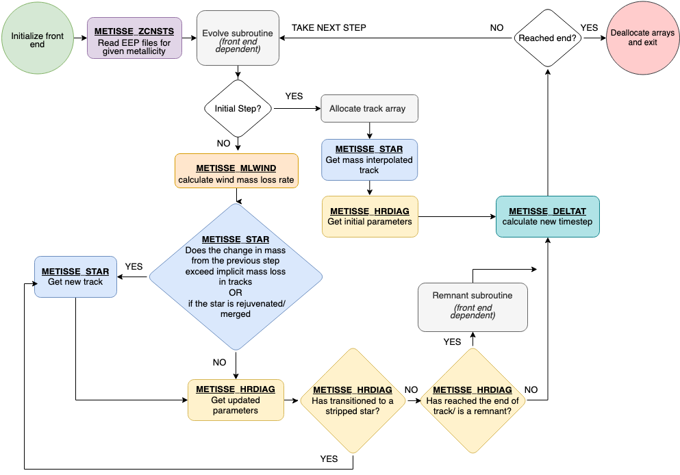

# Package contents

All the programs and subroutines are written in Modern Fortran. 

The METISSE package contains two types of files in the source (*src*) directory: 

## SSE specific subroutines 

METISSE has been developed as an alternative to SSE (Hurley et al. 2000) and, therefore, contains similar subroutines as SSE. The following subroutines replicate the behaviour of the SSE subroutines externally, with similar names and input/output variables.

| File Name           | Description                                                                                             |
|---------------------|---------------------------------------------------------------------------------------------------|
| METISSE_zcnsts.f90    | Controls metallicity (Z) related part of the package.                                         |
| METISSE_star.f90      | Find relevant tracks from the input set and interpolate in mass to get a track of a given mass. |
| METISSE_hrdiag.f90    | Interpolate within the new track to determine stellar parameters at a given age. Also, compute the evolutionary phase of the star including the remnant phases and their properties. |
| METISSE_deltat.f90    | Calculate the time steps depending on the stage of evolution.                                   |
| METISSE_mlwind.f90    | Derive the mass loss through stellar winds.                                                    |
| METISSE_gntage.f90    | Determine the age of a giant star after merger or rejuvenation.                                 |

## Modules and other files

The following Fortran modules contain more general data structures and subroutines specific to METISSE that can be accessed by SSE-specific subroutines as required. 

| File Name           | Description                                                                                             |
|---------------------|---------------------------------------------------------------------------------------------------|
| track_support.f90   | Contains general data structures and functions needed throughout the program.                     |
| interp_support.f90  | Contains functions required for interpolation.                                                    |
| remnant_support.f90 | Contains functions needed to calculate properties of remnant phases.                               |
| z_support.f90       | Together with METISSE_zcnsts, it reads all input namelists and files, including EEP files, and sets Z parameters and other metallicity-based functions. |
| sse_support.f90     | Contains subroutines to calculate SSE-specific quantities.                                         |

In addition to the previously mentioned modules, there is an additional file called *METISSE_miscellaneous.f90*. This file contains miscellaneous subroutines that are necessary for METISSE to function in standalone mode or other contexts. Ideally, these subroutines should also be organized into a module. However, this is not possible because Fortran 77 does not support the use of modules.

It contains:  
| File Name           | Description                                                                                             |
|---------------------|---------------------------------------------------------------------------------------------------------|
| alloc_track.f90     | Allocate the track object.                                                                              |
| dealloc_track.f90   | Deallocate the track object and arrays within.                                                          |
| initialize_front_end| Inform METISSE what code is using it.                                                                   |
| set_star_type      | Set star type to `rejuvenated` before calling star.   

A combination of these files is used depending on how METISSE is being used.

**In the standalone mode:**
| File Name           | Description                                                                                             |
|---------------------|---------------------------------------------------------------------------------------------------------|
| main_metisse.f90    | Main program for running METISSE. Can only evolve single stars. Reads the input files and sets up relevant parameters and data structures before evolving stars of given masses. |
| evolv_metisse.f90   | Controls the evolution of each star and writes output to files.                                         |
| assign_commons_main.f90 | Assign values for variables used in METISSE from SSE_input_controls.                                    |

**As part of other codes:**
| File Name           | Description                                                                                             |
|---------------------|---------------------------------------------------------------------------------------------------------|
| assign_commons_xyz.f90  | To assign common variables when METISSE is used with other code say 'xyz'.                               |
| comenv_lambda.f90   | Get appropriate ZAMS radius and calculate common envelope lambda.                                       |

# Flowchart

Here is a flowchart describing the workflow of METISSE:

